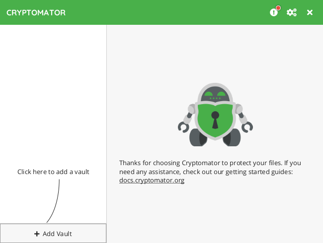
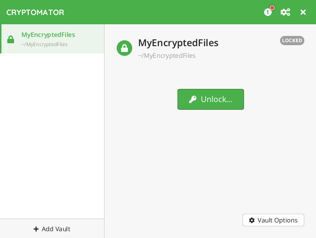
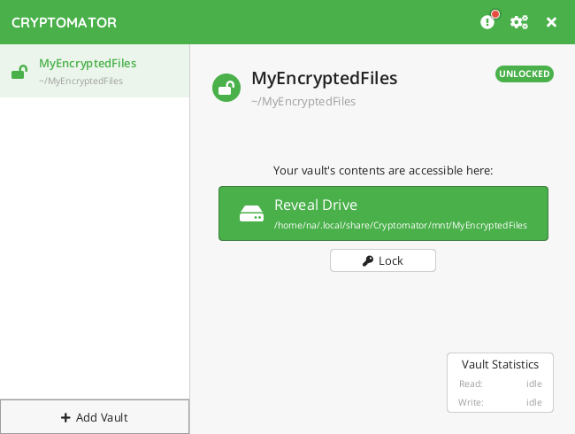
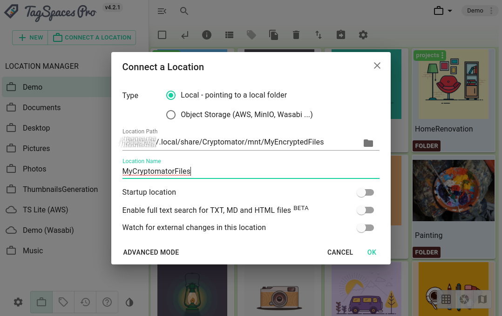

Evernote's recent [change in its pricing plans](https://blog.evernote.com/blog/2016/06/28/changes-to-evernotes-pricing-plans/), restricting non-paying users to only two machines, have been an eye-opener to many. Even though the cloud-crazed hype is trying to convince us otherwise, with all the marketing tools at its disposal, keeping your private data in the cloud, and especially via vendor-locked solutions such as Evernote, had never been a good idea. With such vendor-locked, proprietary services, you do not own your own data, and have no control over its storage, meaning access to your own notes might be severely limited at any time, as it happened just recently.

[TagSpaces](https://www.tagspaces.org/) had long been offering an alternative, self-hosted note-taking solution. Its capable RichText (HTML) and MarkDown editors and previewers can easily replace proprietary software, the plain, flat-file storage paradigm allows total control, and unrestricted access. With the help of third party cloud storage providers, such as Dropbox or Google Drive, you can also easily keep your notes in sync.

Keeping your own files in your own cloud account is undoubtedly a better solution, but it still does not alleviate the problem of storing plain files on other people's computers (which is what servers, and the whole "cloud" really are.) To be reasonably safe, the best bet is to encrypt your data, before sending it off over the Internet.

## Encryption made easy

Encryption might sound daunting to the everyday user, and rightly so. It is a broad topic, there are many solutions, and implementations, often targeting the advanced user, or even the expert. If you just want to secure your notes, it might seem like a little too much work of work. And of course we all prefer an instant solution. This is where [Cryptomator](https://cryptomator.org/) comes into the picture.

Cryptomator is a free and open source, transparent, client-side encryption solution, which makes encrypting your cloud hosted files effortless. The cross-platform software is available for Windows, Mac, Linux, and as an executable Java `.jar`. The platform is absolutely service agnostic: Your encrypted files can be used with any cloud storage provider, as the encryption/decryption happens on your local machine, with as password provided by yourself. Cryptomator integrates into your OS's file system, making encryption as easy as a drag and drop operation in your file manager. How much easier could it be?

## Your encrypted Evernote alternative

From a note-taking perspective, the solution to replacing Evernote with its access-limit, vendor lock, proprietary file format, and "cloud only" approach (meaning "no Internet, no work", unless you buy premium, of course), is really simple with TagSpaces, and any cloud service you prefer. Add Cryptomator to the mix, and your notes are also secured.

### Setting up your encryption solution

First you will need to install **Cryptomator**, which is as easy as downloading the latest version for your platform from the Cryptomator [download site](https://cryptomator.org/downloads/), and running the installer. Next, you will need to connect a new _vault_, which in Cryptomator's terminology, means a folder that you connect to the software to create a virtual drive.

To connect a new vault:

- Open Cryptomator
- Click on the "+" icon on the lover left corner, and
- Select "Create new vault"
- In the file chooser, navigate to the local folder that is synced with your preferred cloud service
- And type a name for your vault.

Once you're done, your new vault should show up on the side pane of Cryptomator's main screen. The vault is now there but not functional, until you set up a password. this password will be used to generate the encryption keys, ensuring that you can easily encrypt/decrypt any file in the vault on ,multiple computers.

- Enter, and confirm a new password
- And press "Create Vault"

Now your new vault is ready to use. To unlock it, you need to enter your password. In the "More options menu underneath, you can change the drive name to whatever you like, and opt to save your password, so that you will not need to enter it on the local machine, each time you want to unlock it. This might be good for single user computers, but you should remember it's always a security risk to store your passwords.

As you enter your password, your vault should be unlocked and automatically mounted on your system. Your File Browser application will most likely fire up, showing your vault mounted as a new `dav` network drive. You can just begin to copy or move files and folders onto this drive, and they will be instantly encrypted by Cryptomator, without you noticing anything. To you all the files and folders will appear as if they were stored in their plain for mat on your file system.

You can also lock the vault any time from within Cryptomator by pressing "Lock"

This will unmount the drive and make the vault's contents unacceptable to anyone locally. When you unlock the vault, you will have full access again.

If open the folder where your vault is stored, you will only find encrypted data, inaccessible from outside Cryptomator's virtual device.

### Adding it to TagSpaces

To complete your setup, [download](https://www.tagspaces.org/downloads/) and install TagSpaces for your platform, if you have not already done so.

You can now easily access your vaulted files from within TagSpaces:

- Make sure Cryptomator is running and the vault containing your files is unlocked.
- Mount the drive, if you have to (although this should happen automatically)
- And connect it as a new location in TagSpaces.

> Important note: You should not be adding the folder in which the Cryptomator vault is located, but rather the virtual dav network drive, which Cryptomator creates. If you need more information about how to mount a drive, you should consult your operating systems's documentation, although Cryptomator should handle this step for you automatically.

Now you can access all your notes inside your Cryptomator vault from within TagSpaces, wile storing them encrypted for both on- and off-line use. If you now synchronize the folder with your cloud service of choice, you can rest assured that your files are safe, private and always accessible, without having to worry about the next policy change from Evernote, or any other proprietary cloud based note-taking service.
