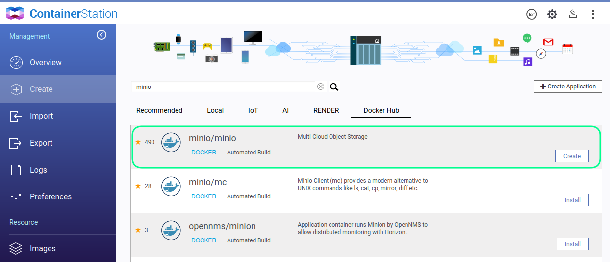
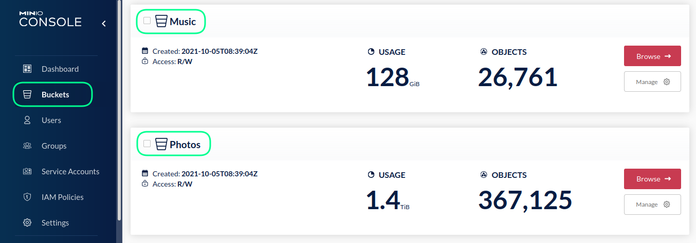
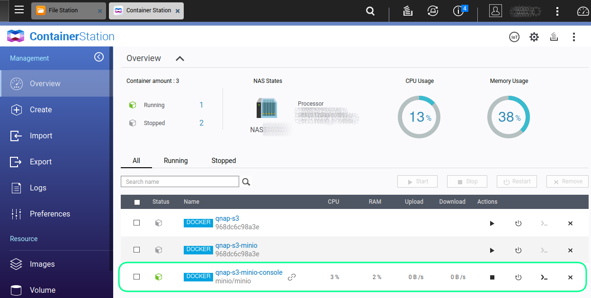
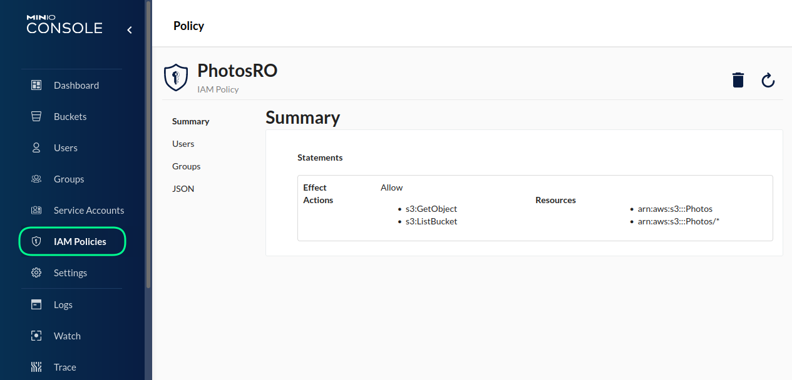
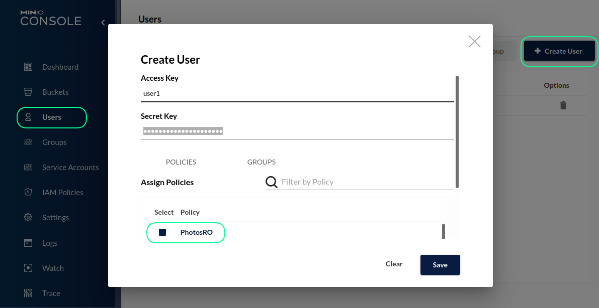

This tutorial will guide through the setting up of a self hosted object storage based on MinIO for QNAP based NAS systems. Then we will show you how to setup the TagSpaces PRO Web on a web server and connect it to the MinIO server. We will use the Docker container apps, which are available on the operating systems of the NAS servers. On a QNAP NAS the app is called **ContainerStation**, so if is not installed please install before starting with your setup.

## Installing the MinIO Docker application

In order to install the current docker image for MinIO you should go to the "Create" section of the ContainerStation. Here you should search for _minio_ in the _Docker Hub_ tab.



After you find the correct application, you should click on the **install** button, which in the previous screenshot is replaced by **create**, since I have already installed this image.

The exact URL of the official MinIO docker is: [`https://hub.docker.com/r/minio/minio`](https://hub.docker.com/r/minio/minio)

## Setup MinIO on a NAS with Docker

The easies way to run it is with the container app, which run Docker in background. This can be done by opening a SSH-connection to your NAS and executing the following command:

```bash
sudo docker run -d \
    --restart=always \
    -p 9000:9000 \
    -p 9001:9001 \
    --name minio-container-name \
    -e MINIO_ROOT_USER=username \
    -e MINIO_ROOT_PASSWORD=password \
    -v /share/DataS3:/data \
    minio/minio server /data \
    --console-address :9001
```

Explanation of the parameters:

- `--restart=always` - makes sure Minio docker image is started automatically after restarting your NAS system
- `-p 9000:9000` will expose MinIO server on both network interfaces (port 9000)
- `-p 9001:9001` will open another port for the MinIO console
- `-name minio-container-name` is the name of the docker container, this name will appear later in the docker software of your NAS
- `MINIO_ROOT_USER` and `MINIO_ROOT_PASSWORD` - are the username and password of the MinIO admin user, which have to be changed to something else for your production system
- `/share/DataS3` is local directory on NAS
- `/data` is the folder which is mapped to /share/DataS3 and which is exposed by MinIO
- `minio/minio` is the official Docker [image](https://hub.docker.com/r/minio/minio) provided by MinIO available at Docker Hub
- `--console-address :9001` is the network interface to where the MinIO service dashboard is exposed

## Test if the MinIO is running

Now you can open you browser and enter the ip address of your NAS with the port 9001 at the end. This should lead to the login screen for the MinIO Console, which is basically their adminstration panel, where you can monitor your installation or manage bucket, user, groups and policies.


And after login it should see the MinIO dashboard. Where you see basic information on your installation.


Navigating to the bucket section will show you a list of all buckets, which are actually sub folder of the exposed NAS directory.



So in my case, `/share/DataS3` is my exposed folder in the docker script. `Photos` and `Music` are sub folders which appear in previous screenshot in the buckets section.


## Manage your MinIO docker instance on QNAP NAS

In order to manager your docker container, there the Container Station app in the QNAP management console.



By navigating to the container you will see further details, including a console log showing the messages from the MinIO server.


## Creating user for accessing the MinIO

It is not recommended to use the MinIO admin user for accessing the bucket. So here you will see how to create users with restricted rights.

So as first step I will go to the **IAM Policies** section and will create a new read-only policy for the `Photos` bucket.



The easiest way to define such policy is to paste the following code in the JSON editor of the policy. Both elements in the `Resource` section of included bellow JSON are needed. The policy is named `PhotosRO`.

```json title="Policy with read only access to the 'Photos' bucket."
{
  "Version": "2012-10-17",
  "Statement": [
    {
      "Effect": "Allow",
      "Action": ["s3:ListBucket", "s3:GetObject"],
      "Resource": ["arn:aws:s3:::Photos", "arn:aws:s3:::Photos/*"]
    }
  ]
}
```

Now is the time to create a new user, so I will go to the **Users** section and click on the **Create User**-button. There you can enter an `Access Key` which is something like user name and `Secret Key` which basically a password. I have also selected the `PhotosRO` policy I have previously created in the **Assign Policies** area.



## Configuring TagSpaces Pro and TagSpaces Pro Web

So these steps should be enough for now so we will open the TagSpaces Pro and configure it to connect with the MinIO server.

Create new cloud location by clicking the **Connect a location** button. In the dialog select **Object Storage** radio box and click **advanced mode** button on the bottom of this dialog. Here you will need to enter the following information:

- Location name - free text allowing you later to recognize the location in the location manager
- Location path - should be left empty, it is currently not supported by TagSpaces for MinIO connections
- Access key - here you should enter the access key MinIO user
- Secret access key - here is the place for the secret access key of the user
- Bucket name - here you should name of one of the subfolder in main folder hosted by MinIO (see the previous screenshot)
- Endpoint URL - the url with with the port where you MinIO instance is running
- Location ID - is automatically generated but can be changed to another unique id if needed, you should not leave it empty.


Once you have configured the location and saved the changes, TagSpaces should connect to it list the files in it.


## Other recommended step

Here I will name some further recommended steps, which are out the scope of this tutorial.

- Setup a SSL certificate for your MinIO docker.
- Setup a SSL certificate for the webserver where the TagSpaces Web App is running
